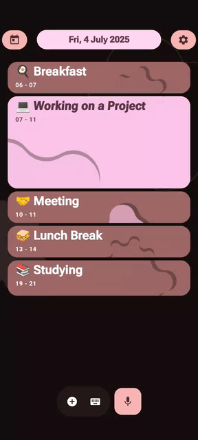
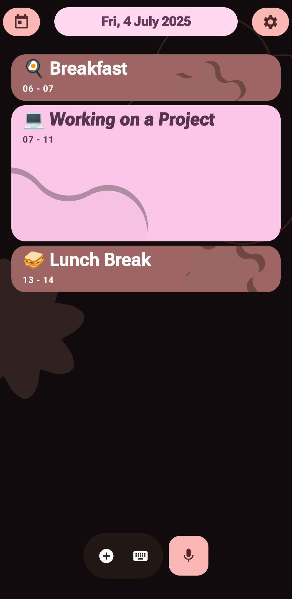
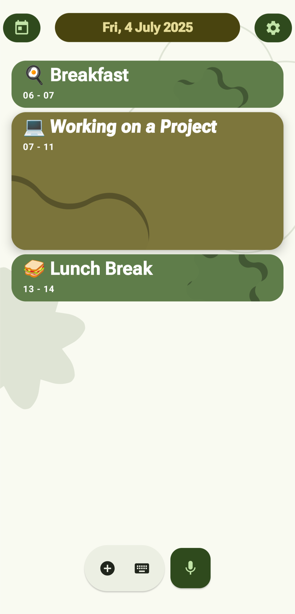

# Caliinda 📆📱

 

**More than just a calendar. It's a personal day-planning assistant, crafted with a deep love for design and user experience.**

Caliinda is my personal project, born from the desire to merge the robust functionality of Google Calendar with a genuinely beautiful, intuitive, and *alive* interface. I believe that planning your daily routine shouldn't be a chore, and this project is my vision of how everyday tasks can become an aesthetic pleasure.

---

### ✨ It's All About the UI/UX!

I've poured my passion for design into every detail, from the smooth animations to the selected color palettes and fonts. The goal is to create an app that you *want* to open every day.
The core design lays in latest Material 3 Expressive from Google.

*(Upload your screenshot to a service like Imgur or directly to your GitHub repo and paste the link here.)*

---

### 🚀 Key Features

*   🎨 **Delightful UI/UX:** Smooth animations, thoughtful color schemes, and clean typography. Material 3 Expressive based!
*   ⚡️ **Effortless Event Creation:** Smart tweaks and intuitive gestures for adding tasks in seconds.
*   🤖 **Intelligent Assistant (In Development):** An integrated AI agent to manage your calendar with voice and text commands. Proactive agent with way beyond boundaries apart of Google Gemini.
*   🔄 **Full Google Calendar Sync:** Mostly all your events, seamlessly integrated in one place. !!Events for more than 1 day are currently not supported (there will be another approach to visualise them)!!
*   📱 **Native Android Client:** Built with Kotlin and Jetpack Compose for maximum performance and a modern feel.

---

### 🛠️ Tech Stack

*   **Backend:** Python, FastAPI, SQLAlchemy, PostgreSQL, GoogleADK
*   **Frontend (Android):** Kotlin, Jetpack Compose
*   **DevOps:** Docker, Docker Compose (Kubernetes planned)
*   **Databases:** PostgreSQL (user data [access tokens only])

---

### 🛣️ Project Status & Roadmap

This project is under active development.

*   [✅] Core Backend Architecture (Python/FastAPI)
*   [✅] Google OAuth2 Authentication
*   [✅] CRUD Operations for Google Calendar Events
*   [✅] Fully functioning app with events management.
*   [🚧] **In Progress:** AI Assistant
*   [🚧] **In Progress:** Test Coverage with `pytest`
*   [⬜️] **Planned:** CI/CD Pipeline with GitHub Actions
*   [⬜️] **Planned:** 24+ hours events visibility
*   [⬜️] **Planned:** Deep Integration of AI based features (suggestions, recommendations)
*   [⬜️] **Planned:** Google Play Store Release

---

### 🤝 Contributing

While this is a personal pet project, I'm always open to ideas and suggestions! Feel free to open an `Issue` if you have a thought on how to make Caliinda better.

  
  

---

### 📬 Contact

Pavel Luchkov - [sliderlaad222@gmail.com](mailto:sliderlaad222@gmail.com) - [Telegram: @lpavs](https://t.me/lpavs)

Project Link: [https://github.com/PaveLuchkov/CaliindaApp](https://github.com/PaveLuchkov/CaliindaApp)